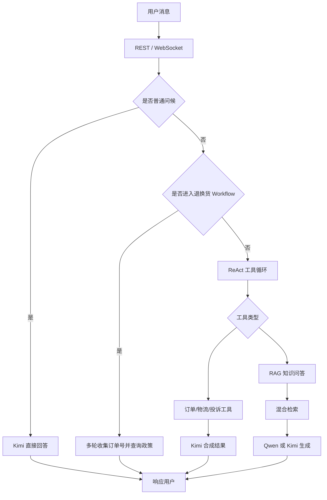
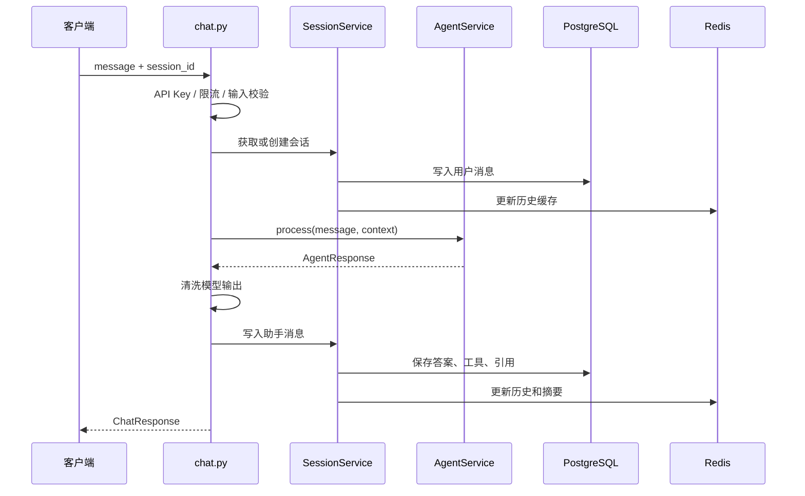
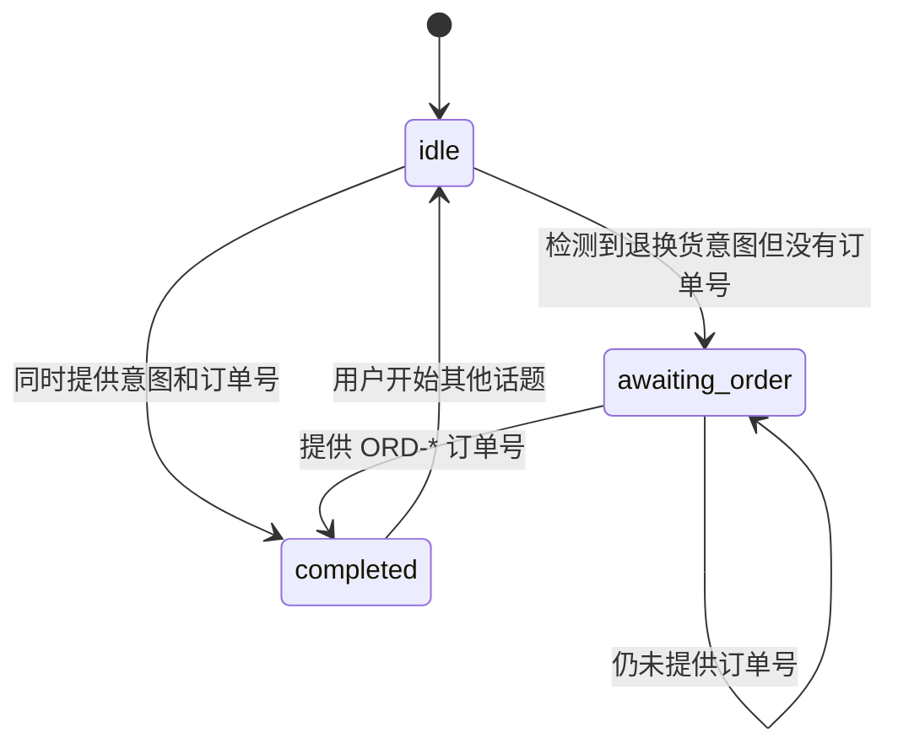
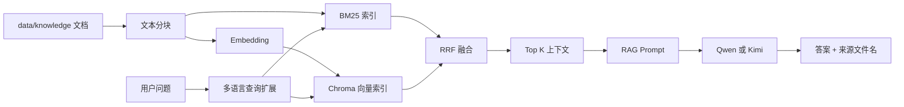

# 智能客服项目深度学习指南

> 项目：`zhineng_kefu`  
> 目标：从“能运行”逐步达到“能解释、能调试、能扩展、能评审”的程度。  
> 建议方式：按章节阅读源码，每完成一章都执行对应实验，而不是只阅读文档。

---

## 1. 学完后你应该具备的能力

完成本指南后，你应该能够：

1. 从 `src/main.py` 讲清 FastAPI 应用的初始化和关闭过程。
2. 追踪一条聊天消息从浏览器进入后端，再到数据库和模型的完整链路。
3. 解释 Agent、Workflow 和 RAG 为什么同时存在，以及它们的处理优先级。
4. 说明 Kimi 和本地 Qwen 在系统中的不同职责。
5. 解释 BM25、向量检索和 RRF 融合的作用。
6. 理解 PostgreSQL 与 Redis 分别存储什么，以及 Redis 故障后的表现。
7. 独立添加一个 Agent 工具、一种 Workflow 状态或一个 API 接口。
8. 使用测试、日志、Prometheus 指标和健康检查定位问题。
9. 识别当前实现中影响生产部署的安全与架构风险。

---

## 2. 项目一句话定义

这是一个面向跨境电商场景的**生产级**智能客服系统（仓库：`zhineng_kefu`）：

- FastAPI 提供 REST 和 WebSocket 接口，附带 Web 聊天页与 React 管理后台；
- Kimi 负责 Agent 编排、工具选择和多工具结果合成；
- 本地 Qwen+LoRA 或云端 Kimi 根据知识库生成 RAG 答案；
- PostgreSQL 保存会话、投诉、反馈、用户等长期数据；
- Redis 保存短期会话上下文、滚动摘要和 Workflow 状态；
- BM25 与 ChromaDB 混合检索（RRF），配合跨语言扩展与检索后处理；
- 支持中 / 英 / 阿等多语言自动匹配回复。

> 总览与快速上手见根目录 [README.md](README.md)；本机 Python 约定见 [运行环境.md](运行环境.md)。

这个项目不是“把用户问题直接发给大模型”，而是先判断应该走哪条处理路径：



---

## 3. 建议先掌握的基础知识

如果某项不熟悉，先了解概念，不必一开始研究所有底层细节。

### Python

- `async` / `await`
- 异步生成器与 `async for`
- 类型注解和 `Protocol`
- `dataclass`
- 上下文管理器
- 依赖注入

### Web

- HTTP 请求和响应
- REST API
- WebSocket 长连接
- JWT、Cookie、API Key
- CORS 与限流

### 数据

- SQLAlchemy ORM
- PostgreSQL 事务
- Redis Key、TTL 和缓存
- 数据库迁移

### AI

- Prompt
- Function Calling
- ReAct
- Embedding
- RAG
- BM25
- 向量相似度
- RRF 排名融合
- LoRA

---

## 4. 目录地图

先建立目录级认知，不要立即陷入函数细节。

```text
zhineng_kefu/
├── src/
│   ├── main.py                    # FastAPI 入口与生命周期
│   ├── core/                      # 配置、安全、指标、Tracing
│   ├── api/                       # HTTP 与 WebSocket 接口
│   ├── services/                  # Agent、会话、LLM、Workflow
│   ├── tools/                     # Agent 可调用的业务工具
│   ├── rag/                       # 分块、检索、Embedding、Prompt
│   ├── models/                    # SQLAlchemy 数据模型
│   └── eval/                      # 评测数据读取
├── frontend/                      # 用户聊天页，原生 HTML/JS
├── frontend-admin/                # React/Vite 管理后台
├── tests/                         # pytest 测试
├── data/
│   ├── knowledge/                 # 原始知识文档
│   ├── chroma/                    # 向量索引
│   └── eval/                      # Golden QA
├── scripts/                       # 索引重建、Agent/RAG 评测
├── alembic/                       # 数据库迁移
├── docker/                        # 镜像、Compose、Nginx
├── pyproject.toml                 # Python 依赖与工具配置
└── README.md                      # 项目说明
```

### 第一遍只回答三个问题

1. 哪些文件负责“接收请求”？
2. 哪些文件负责“做业务决策”？
3. 哪些文件负责“访问外部资源”？

建议答案：

- 请求入口：`src/main.py`、`src/api/routes/`
- 业务决策：`src/services/agent_service.py`、`src/services/workflows/`
- 外部资源：`src/services/llm/`、`src/tools/`、`src/db.py`、`src/redis_client.py`

---

## 5. 第一阶段：理解应用如何启动

### 5.1 阅读文件

按顺序阅读：

1. `pyproject.toml`
2. `src/core/config.py`
3. `src/main.py`
4. `src/db.py`
5. `src/redis_client.py`

### 5.2 依赖组织

`pyproject.toml` 将依赖分为：

- 核心依赖：FastAPI、SQLAlchemy、Redis、OpenAI SDK、ChromaDB 等；
- `rag`：Sentence Transformers；
- `gpu`：PyTorch、Transformers、PEFT、ModelScope；
- `test`：pytest、aiosqlite、testcontainers；
- `lint`：Ruff；
- `otel`：OpenTelemetry。

这意味着“安装成功”不等于“所有功能都可用”。例如没有安装 `rag` 或 `gpu` 可选依赖时，向量模型或本地 Qwen 可能不可用。

项目规定使用：

```bash
/opt/anaconda3/envs/kefu/bin/python
/opt/anaconda3/envs/kefu/bin/pip
```

不要使用项目 `.venv` 或系统 Python。

### 5.3 配置加载

`src/core/config.py` 使用 Pydantic Settings：

- 从项目根目录 `.env` 读取配置；
- 将知识库、Chroma 和 LoRA 的相对路径转换成项目绝对路径；
- 使用 `@lru_cache` 保证进程内复用同一个 Settings；
- 用 `Literal` 限制部分配置值，例如 `rag_backend` 只能是 `local` 或 `cloud`。

重点配置分组：

- Kimi：模型、Base URL、API Key；
- Qwen：模型路径、LoRA 路径、远程推理地址；
- RAG：Top K、Chunk Size、检索器类型、Embedding 模型；
- 数据：PostgreSQL、Redis；
- 安全：API Key、JWT、CORS；
- 运维：日志、Prometheus、OpenTelemetry。

学习配置时只查看变量名和用途，不要在笔记或日志中复制 `.env` 的真实密钥。

### 5.4 FastAPI 生命周期

`src/main.py` 的 `lifespan()` 是第一条重要主线：

```text
加载配置
  → 校验生产安全配置
  → 构建知识检索器
  → 创建 Kimi 客户端
  → 按配置加载本地/远程 Qwen
  → 连接 Redis
  → 创建 AgentService 和 SessionService
  → 初始化数据库表
  → 接收请求
  → 服务关闭时释放模型、Redis、数据库资源
```

服务对象被放入 `app.state`：

- `app.state.agent_service`
- `app.state.session_service`
- `app.state.retriever`

路由再通过依赖函数取得这些对象。这是一种简单的应用级依赖注入。

### 5.5 阶段实验

执行前先保证 PostgreSQL、Redis 和环境变量已经配置。

```bash
/opt/anaconda3/envs/kefu/bin/python -m uvicorn src.main:app \
  --host 0.0.0.0 --port 8000 --reload
```

观察并回答：

1. 启动日志中 RAG 使用 local 还是 cloud？
2. Redis 连接失败时服务是否还能启动？
3. Qwen 加载失败后系统会选择什么生成路径？
4. `/health` 与 `/health/deep` 有何区别？

---

## 6. 第二阶段：追踪一条 REST 聊天请求

### 6.1 阅读顺序

1. `src/api/routes/chat.py`
2. `src/api/deps.py`
3. `src/core/security.py`
4. `src/core/input_guard.py`
5. `src/services/session_service.py`
6. `src/db.py`

### 6.2 REST 主链路

入口是：

```text
POST /api/v1/chat
```

完整过程：



### 6.3 需要重点理解的边界

路由层负责：

- 请求格式；
- API Key；
- 限流；
- 输入校验；
- HTTP 状态码；
- 会话与消息落库；
- 响应格式。

Agent 层负责：

- 理解问题；
- 决定是否使用工具；
- 调用工具；
- 生成最终答案。

不要把数据库提交、HTTP 异常等接口职责继续堆进 Agent。

### 6.4 输入和输出模型

输入 `ChatRequest`：

- `message`：1～2000 字符；
- `session_id`：可选。

输出 `ChatResponse`：

- `session_id`
- `answer`
- `tool_name`
- `citations`
- `tools_used`

`tools_used` 比单独的 `tool_name` 更完整，因为 Agent 一轮可以并行调用多个工具。

### 6.5 阶段实验

尝试以下请求并观察返回差异：

1. “你好”
2. “退货”
3. “我要退货，订单号 ORD-1001”
4. “我的订单有哪些”
5. “查订单 ORD-1001 和它的物流”
6. 一个知识库中不存在的问题

记录每次请求的：

- 是否调用工具；
- 调用了哪些工具；
- 是否有 citations；
- 是否创建了新 session；
- PostgreSQL 和 Redis 中分别发生了什么。

---

## 7. 第三阶段：理解 WebSocket 流式聊天

### 7.1 阅读顺序

1. `src/api/routes/chat.py` 中的 `websocket_chat`
2. `src/services/agent_service.py` 中的 `process_stream`
3. `src/services/llm/kimi_client.py` 中的 `chat_stream`
4. `frontend/app.js`

### 7.2 WebSocket 协议

服务端主要发送四类事件：

- `session`：后端新建了会话；
- `chunk`：一段流式内容；
- `done`：本轮完整结果；
- `error`：校验或处理失败。

流式回答不是所有路径都来自真正的模型 Token：

- Kimi/Qwen：模型流式 Token；
- Workflow 固定回答：按固定字符数模拟分块；
- 多工具：Kimi 合成结果的流式 Token。

### 7.3 REST 与 WebSocket 的关键区别

- REST 依赖请求级数据库 Session，结束时自动提交；
- WebSocket 是长连接，每条消息内部创建数据库 Session；
- WebSocket 必须显式 `commit()`；
- WebSocket 客户端中途断开时，助手消息可能不会写入数据库；
- WebSocket 限流保存在当前 Python 进程内，多 Worker 不共享状态。

### 7.4 阶段实验

在浏览器聊天时打开开发者工具：

1. 查看 WebSocket Frames；
2. 找到 `session`、`chunk`、`done` 事件；
3. 在生成中途断开网络；
4. 恢复连接后查看会话历史是否完整；
5. 思考如何实现“断线续传”或“生成任务后台继续”。

---

## 8. 第四阶段：深挖 Agent 编排

### 8.1 阅读顺序

1. `src/services/agent_service.py`
2. `src/tools/registry.py`
3. `src/rag/prompts.py`
4. `src/services/llm/kimi_client.py`
5. `src/utils/tool_answer.py`

### 8.2 Agent 的三层优先级

`AgentService.process()` 的决策顺序非常重要：

```text
问候短路
  → 退换货 Workflow
  → ReAct 工具循环
  → 无工具时直接聊天
  → 单 RAG 工具直接返回
  → 多工具交给 Kimi 合成
  → 合成为空时规则兜底
```

为什么问候要短路？

- 降低一次工具选择开销；
- 避免简单问题被错误路由；
- 减少响应延迟。

为什么 Workflow 在 ReAct 前？

- 退换货是确定性多轮流程；
- 必须记住“正在等待订单号”；
- 仅依赖 LLM 容易跳步骤或忘记状态。

### 8.3 ReAct 循环

`_run_react()` 的核心思想：

1. 将系统提示、最近上下文和用户问题发给 Kimi；
2. Kimi 返回零个或多个 Function Call；
3. 后端执行工具；
4. 将工具结果以 `role=tool` 放回消息列表；
5. 继续下一步，直到模型不再选择工具或达到步数上限。

默认最多执行 `AGENT_MAX_STEPS` 步。

当一轮返回多个工具调用时，项目使用 `asyncio.gather()` 并行执行。这适用于互不依赖的工具；如果工具 B 必须依赖工具 A 的结果，则应该分成两个 ReAct 步骤。

### 8.4 工具注册

`src/tools/registry.py` 定义 Function Calling Schema。当前工具包括：

- `fetch_logistics_information`
- `record_user_complaint`
- `create_return_request`
- `customer_chat`
- `query_order`
- `query_my_orders`

每个工具都包含：

- 名称；
- 用途描述；
- JSON 参数类型；
- 必填参数。

工具描述不仅是文档，也是 Agent 的路由规则。描述含糊会直接降低工具选择准确率。

### 8.5 工具执行

`AgentService._call_tool()` 是当前的中央分发器。它还负责：

- 为工具调用计数；
- 统计工具耗时；
- 注入 Retriever、Qwen、Kimi、数据库和用户信息；
- 拒绝未知工具；
- 对需要登录的工具进行前置检查。

这种 `if/elif` 分发简单直观，但工具数量增加后可以考虑注册表模式：

```python
handlers = {
    "query_order": query_order_handler,
    "customer_chat": customer_chat_handler,
}
```

不要急着重构。先理解当前实现，再根据真实扩展压力决定。

### 8.6 答案合成

项目区分两种情况：

- 单个 RAG 工具已经生成完整自然语言答案：直接返回，避免二次 LLM 改写；
- 多个业务工具返回结构化结果：由 Kimi 合成为一个用户友好的答案。

如果 Kimi 合成结果为空，`format_tool_steps_answer()` 提供规则式兜底。

### 8.7 阶段实验：新增一个工具

建议实现一个无副作用的练习工具，例如：

```text
check_service_hours
```

完成步骤：

1. 在 `src/tools/` 新增实现；
2. 在 `src/tools/registry.py` 添加 Schema；
3. 在 `AgentService._call_tool()` 添加分发；
4. 在 Prompt 中确保使用场景清晰；
5. 添加工具单元测试；
6. 添加 Agent 路由测试；
7. 分别验证 REST 和 WebSocket。

验收问题：

- 工具参数缺失时会怎样？
- 工具异常是否会中断整个 Agent？
- 工具结果是否需要 Kimi 二次合成？
- 工具是否允许并行调用？

---

## 9. 第五阶段：理解退换货 Workflow

### 9.1 阅读文件

- `src/services/workflows/return_workflow.py`
- `src/services/session_service.py`
- `tests/test_return_workflow.py`

### 9.2 状态机

当前状态：



状态保存在：

```text
session:{session_id}:workflow
```

并带 TTL。

### 9.3 为什么不用纯 Agent

Workflow 适合：

- 步骤固定；
- 有必填字段；
- 中途需要暂停等待用户；
- 需要审计当前状态；
- 不允许模型自由跳过步骤。

Agent 适合：

- 用户意图开放；
- 工具组合不固定；
- 问题无法提前穷举。

### 9.4 当前限制

- 订单号只识别 `ORD-*` 格式；
- 状态完全依赖 Redis；
- Redis 不可用时只能完成简化处理；
- Workflow 调用私有方法 `agent._call_tool()`，耦合较强；
- `completed` 状态的退出依赖后续消息内容。

### 9.5 阶段实验

扩展一个状态，例如 `awaiting_reason`：

1. 用户提出退货；
2. 收集订单号；
3. 再收集退货原因；
4. 信息完整后调用工具。

实现前先画状态图，并为每条状态迁移写测试。

---

## 10. 第六阶段：深挖 RAG

### 10.1 阅读顺序

1. `src/rag/chunker.py`
2. `src/rag/tokenizer.py`
3. `src/rag/retriever.py`
4. `src/rag/embeddings.py`
5. `src/rag/fusion.py`
6. `src/rag/multilingual.py`
7. `src/rag/prompts.py`
8. `src/tools/knowledge_chat.py`
9. `scripts/rebuild_index.py`

### 10.2 RAG 完整链路



### 10.3 BM25

BM25 是关键词检索：

- 对订单号、产品型号、专有名词较敏感；
- 不需要神经网络模型；
- 不能很好理解同义表达和语义相近问题。

项目使用 `jieba` 等逻辑对查询和知识块分词，再根据 BM25 得分排序。

### 10.4 向量检索

向量检索：

- 将问题和知识块映射到 Embedding；
- 使用向量距离寻找语义相近内容；
- 能召回措辞不同但意思相近的知识；
- 依赖 Embedding 模型与 Chroma 索引。

当前默认 Embedding 模型是 `BAAI/bge-m3`。

### 10.5 Hybrid + RRF

`HybridRetriever` 同时获取 BM25 和向量候选，然后通过 Reciprocal Rank Fusion 合并排名。

RRF 关注“某条结果在每个列表中的排名”，而不是直接比较两种检索器不可统一的原始分数。

简化理解：

```text
RRF 分数 = Σ 1 / (k + rank)
```

同一知识块如果在两个结果列表中都靠前，融合后通常也会更靠前。

### 10.6 多语言检索

项目支持中文、英文和阿拉伯语：

1. 检测用户语言；
2. 生成跨语言查询变体；
3. 对多个查询分别检索；
4. 再次融合结果；
5. 优先排列与用户语言一致的知识块；
6. 要求模型使用用户语言回答。

多语言检索并不只是“最后翻译答案”，它还影响召回阶段。

### 10.7 生成模型路由

`src/tools/knowledge_chat.py` 中的规则：

```text
RAG_BACKEND=local
且 Qwen 可用
且用户问题是中文
    → 使用 Qwen
否则 Kimi 可用
    → 使用 Kimi
否则
    → 返回固定兜底文本
```

因此：

- Kimi 始终承担 Agent 编排；
- Qwen 主要承担中文 RAG 生成；
- 英文和阿拉伯语通常由 Kimi 生成；
- Retriever 与生成模型是两个独立阶段。

### 10.8 没有召回结果时

如果没有知识块：

- 有 Kimi：让 Kimi礼貌说明未找到，并建议人工客服；
- 无 Kimi：返回固定兜底答案。

这避免模型在没有知识依据时伪造政策答案，但最终约束强度仍取决于 Prompt。

### 10.9 阶段实验

选择同一个知识点，构造五类问题：

1. 原文关键词完全匹配；
2. 同义改写；
3. 英文提问；
4. 阿拉伯语提问；
5. 包含错误产品名的提问。

分别将 `RETRIEVER_TYPE` 设置为：

- `bm25`
- `vector`
- `hybrid`

记录：

- 召回的文件；
- Top K 顺序；
- 最终答案；
- 响应延迟；
- 是否出现无依据内容。

不要只比较“答案看起来好不好”，还要先检查召回内容是否正确。

---

## 11. 第七阶段：会话、数据库与 Redis

### 11.1 PostgreSQL

长期保存的数据包括：

- 用户；
- 会话；
- 消息；
- 投诉；
- 反馈；
- 知识文档元数据。

消息还会保存：

- 使用过的工具；
- 引用来源；
- 创建时间。

### 11.2 Redis

Redis Key：

```text
session:{id}:history
session:{id}:summary
session:{id}:workflow
```

用途：

- `history`：最近若干条消息；
- `summary`：约 500 字符的滚动摘要；
- `workflow`：退换货状态。

### 11.3 上下文构造

`SessionService.get_context_messages()`：

1. 优先读取 Redis 历史；
2. 没有缓存时读取 PostgreSQL；
3. 如果存在摘要，将摘要作为 system 消息放到历史之前。

注意：当前摘要不是 LLM 总结，而是用户和助手消息片段的滚动拼接。因此它便宜、稳定，但可能截断重要语义。

### 11.4 一致性思考

项目写消息时：

1. 添加 PostgreSQL ORM 对象并 `flush()`；
2. 更新 Redis；
3. 稍后提交 PostgreSQL 事务。

思考异常场景：

- Redis 写成功但数据库提交失败；
- 数据库写成功但 Redis 写失败；
- WebSocket 在响应中途断开；
- 同一会话同时发送两条消息。

这些问题属于缓存一致性、事务边界和并发控制，不是简单补一个 `try/except` 就能完全解决。

### 11.5 Schema 管理风险

当前同时存在：

- Alembic 迁移；
- 启动时 `Base.metadata.create_all()`。

而初始迁移没有覆盖所有模型。生产项目通常应让 Alembic 成为唯一 Schema 变更来源，避免数据库结构在不同环境中漂移。

### 11.6 阶段实验

1. 正常聊天几轮；
2. 查看 PostgreSQL 消息；
3. 查看 Redis 三类 Key；
4. 停止 Redis；
5. 继续聊天；
6. 比较历史、摘要和 Workflow 的变化；
7. 重新启动 Redis，观察缓存是否自动恢复。

---

## 12. 第八阶段：LLM 客户端与本地模型

### 12.1 Kimi

`src/services/llm/kimi_client.py` 基于 OpenAI 兼容接口，负责：

- 普通聊天；
- 流式聊天；
- Function Calling；
- 单工具答案合成；
- 多工具答案合成；
- Token 和延迟指标。

`sanitize_messages_for_api()` 会处理空的 assistant content，避免 Moonshot API 拒绝包含工具调用的消息。

### 12.2 本地 Qwen

重点阅读：

- `src/services/llm/local_qwen.py`
- `src/services/llm/remote_qwen.py`
- `src/api/routes/inference.py`

两种部署方式：

- API 进程直接加载本地模型；
- 独立 GPU Worker 加载模型，API 通过 HTTP 调用。

独立 Worker 的好处：

- API 与 GPU 生命周期解耦；
- 更容易扩容；
- 模型崩溃不一定拖垮主 API；
- 可以给模型分配单独容器和资源限制。

需要注意：

- 模型加载失败后会降级到 Kimi；
- LoRA 权重不会自动随仓库完整分发；
- 并发推理需要队列控制，否则容易 OOM；
- 本地生成质量与 Prompt、基础模型、LoRA 数据强相关。

### 12.3 阶段实验

对同一批中文知识问题分别使用：

- `RAG_BACKEND=cloud`
- `RAG_BACKEND=local`

比较：

- 首 Token 延迟；
- 总耗时；
- 回答完整性；
- 引用一致性；
- 语言风格；
- GPU 显存占用；
- 单次成本。

---

## 13. 第九阶段：测试策略

### 13.1 阅读顺序

1. `tests/conftest.py`
2. `tests/test_api.py`
3. `tests/test_agent_service.py`
4. `tests/test_return_workflow.py`
5. `tests/test_session_service.py`
6. `tests/test_tools.py`
7. `tests/test_multilingual.py`

### 13.2 当前测试特点

- 使用 pytest 和 pytest-asyncio；
- 测试数据库主要使用内存 SQLite；
- Agent 测试 Mock Kimi，不调用真实模型；
- 覆盖问候短路和并行工具调用；
- Workflow 使用状态迁移测试；
- 多语言逻辑有独立测试；
- CI 会运行 Ruff、pytest 和 Docker build。

### 13.3 单元测试应验证什么

以 Agent 为例，不要断言模型的具体自然语言，而应断言：

- 是否跳过 ReAct；
- 是否选择正确工具；
- 工具参数是否正确；
- 多工具是否全部执行；
- 是否触发答案合成；
- citations 和 tools_used 是否正确。

测试 LLM 文案本身通常不稳定，测试控制流更可靠。

### 13.4 测试命令

```bash
/opt/anaconda3/envs/kefu/bin/python -m pytest tests -v
/opt/anaconda3/envs/kefu/bin/python -m ruff check src tests
```

### 13.5 建议补充的测试

- PostgreSQL + Redis testcontainers 集成测试；
- Alembic 从空库升级测试；
- WebSocket 断连与重连测试；
- Redis 故障降级测试；
- Qwen Worker 超时测试；
- 工具异常是否污染数据库事务；
- RAG 索引更新后召回是否变化；
- 浏览器端到端聊天测试。

---

## 14. 第十阶段：日志、指标与故障定位

### 14.1 日志

项目使用 structlog，常见事件包括：

- 应用启动；
- Qwen 加载成功或失败；
- ReAct 工具步骤；
- 聊天处理失败；
- WebSocket 未处理异常；
- 会话删除。

故障定位时应携带：

- `session_id`
- `user_id`
- 工具名称
- 请求方式
- 耗时

不要把 API Key、JWT、用户隐私和完整 Prompt 直接写入日志。

### 14.2 Prometheus

项目统计：

- 聊天请求量；
- REST/WebSocket 延迟；
- 工具选择次数；
- 工具执行耗时；
- RAG 查询和命中；
- Kimi Token；
- 会话和投诉等业务指标。

学习时重点区分：

- Counter：只增不减的累计值；
- Histogram：耗时等分布；
- Label：按工具、请求方式等维度拆分。

Label 值不能无限增长，否则会造成高基数问题。不要把 `session_id` 作为 Prometheus Label。

### 14.3 故障定位顺序

当用户说“回答不对”时，按以下顺序检查：

1. 输入是否被正确接收？
2. 会话上下文是否正确？
3. Agent 选择了哪个路径？
4. 选择了哪个工具？
5. 工具参数是否正确？
6. RAG 召回了哪些 Chunk？
7. Prompt 中实际提供了什么上下文？
8. 使用了 Qwen 还是 Kimi？
9. 模型原始输出是否被清洗或截断？
10. 最终响应是否成功落库？

不要一开始就把所有问题归因于“模型不够聪明”。

---

## 15. 前端学习路径

### 用户聊天页

阅读：

- `frontend/index.html`
- `frontend/app.js`
- `frontend/i18n.js`
- `frontend/styles.css`

重点：

- 如何获取运行时配置；
- 如何创建 WebSocket；
- 如何处理 `chunk` 和 `done`；
- 如何保存 session 和 JWT；
- WebSocket 不可用时如何降级 REST；
- 多语言界面如何切换。

### 管理后台

阅读：

- `frontend-admin/src/App.jsx`
- `frontend-admin/src/api.js`
- `frontend-admin/src/pages/`
- `frontend-admin/vite.config.js`

重点：

- React Router 页面组织；
- API Key 注入；
- 知识库上传；
- 投诉处理；
- Prometheus 文本解析；
- 开发代理和生产静态构建。

---

## 16. Docker 与部署

阅读：

- `docker/docker-compose.yml`
- `docker/Dockerfile.api`
- `docker/Dockerfile.gpu`
- `docker/entrypoint.sh`
- `docker/nginx.conf`

服务关系：

```text
Nginx
  → FastAPI API
      → PostgreSQL
      → Redis
      → Moonshot Kimi
      → 可选 GPU RAG Worker
```

需要理解的部署差异：

- API 镜像默认更适合 cloud RAG；
- GPU Worker 使用独立 CUDA 镜像；
- 管理后台构建产物不一定进入 API 镜像；
- Nginx 的反向代理路径没有覆盖所有 FastAPI 路径；
- 数据库迁移失败在入口脚本中可能被忽略。

---

## 17. 当前最值得关注的设计问题

### 高优先级

1. `/config.js` 将 API Key 发给浏览器，不能作为可信的生产鉴权。
2. 邮箱登录无需密码，OAuth Token 也未完整校验。
3. Alembic 与 `create_all()` 双轨管理 Schema。
4. 数据库迁移缺少部分模型。

### 中优先级

1. Redis 与 Qwen 故障会静默降级，告警不够明确。
2. WebSocket 限流只在单进程内有效。
3. 工具执行异常处理不统一。
4. Workflow 依赖 Agent 私有方法。
5. 本地、Docker、CI 的 Python 版本不完全一致。

### 学习这些问题的方法

对每个问题回答：

1. 触发条件是什么？
2. 用户可见症状是什么？
3. 日志和指标能否发现？
4. 数据会不会丢失或不一致？
5. 临时缓解方式是什么？
6. 根本修复需要改哪些模块？
7. 如何写自动化测试证明修复有效？

---

## 18. 四周学习计划

### 第 1 周：应用与请求链路

- 第 1 天：目录、依赖、配置；
- 第 2 天：FastAPI 生命周期；
- 第 3 天：REST 聊天链路；
- 第 4 天：WebSocket 流式链路；
- 第 5 天：PostgreSQL 与 Redis；
- 第 6 天：手动画完整时序图；
- 第 7 天：复盘并口头讲解。

验收：不看文档，能从前端消息一路讲到答案落库。

### 第 2 周：Agent 与业务流程

- 第 1 天：Kimi Function Calling；
- 第 2 天：ReAct 循环；
- 第 3 天：六个工具；
- 第 4 天：多工具并发与答案合成；
- 第 5 天：退换货 Workflow；
- 第 6 天：新增练习工具；
- 第 7 天：补充测试。

验收：能独立添加一个工具并解释它是否适合并行执行。

### 第 3 周：RAG 与模型

- 第 1 天：知识分块；
- 第 2 天：BM25；
- 第 3 天：Embedding 和 Chroma；
- 第 4 天：RRF 与多语言检索；
- 第 5 天：RAG Prompt；
- 第 6 天：Qwen/Kimi 对比实验；
- 第 7 天：整理评测结果。

验收：面对错误答案，能判断问题出在召回还是生成。

### 第 4 周：生产化

- 第 1 天：认证与输入安全；
- 第 2 天：Alembic 和事务；
- 第 3 天：日志、Prometheus、Tracing；
- 第 4 天：Docker 和 GPU Worker；
- 第 5 天：故障注入；
- 第 6 天：形成改进方案；
- 第 7 天：完成一次架构评审。

验收：能够列出上线阻塞项，并给出测试可验证的修复计划。

---

## 19. 推荐实践任务

按难度从低到高：

1. 修改一个工具描述，并测试 Agent 路由变化。
2. 新增一个只读工具。
3. 为 Redis 不可用增加更明确的健康状态。
4. 给 RAG 输出增加可调试的召回分数。
5. 增加 PostgreSQL/Redis 集成测试。
6. 补齐 Alembic 迁移并取消启动时自动建表。
7. 将 WebSocket 限流迁移到 Redis。
8. 完善 Google OAuth Token 校验。
9. 设计浏览器端不暴露服务端 API Key 的鉴权方案。
10. 建立离线 RAG 评测和回归阈值。

每个任务都应该包含：

- 需求说明；
- 设计决策；
- 代码修改；
- 单元或集成测试；
- 失败场景；
- 观测方式；
- 回滚方案。

---

## 20. 自测问题

如果能独立回答下面的问题，说明已经形成较完整的项目认知。

### 架构

1. 为什么 Kimi 和 Qwen 不能简单视为相同用途的模型？
2. 为什么 Retriever 与 Generator 要分开？
3. 为什么退换货用 Workflow，而普通咨询用 Agent？

### 请求链路

1. REST 和 WebSocket 的事务边界有什么不同？
2. WebSocket 中途断开可能丢失什么？
3. `session_id` 在哪里创建、校验和使用？

### Agent

1. 什么情况下不会进入 ReAct？
2. 多工具为什么可以并行？什么时候不能并行？
3. 为什么单个 RAG 工具结果直接返回？
4. 达到最大 ReAct 步数后会发生什么？

### RAG

1. BM25 与向量检索各自擅长什么？
2. 为什么使用 RRF，而不是直接相加原始分数？
3. 多语言处理发生在哪些阶段？
4. 如何判断错误答案来自召回还是生成？

### 数据

1. PostgreSQL 和 Redis 分别保存什么？
2. Redis 不可用时哪些功能仍然工作？
3. 当前缓存与数据库可能产生哪些不一致？
4. `create_all()` 与 Alembic 同时使用有什么风险？

### 生产化

1. 为什么浏览器中的 API Key 不是真正的秘密？
2. 当前登录流程为什么不能直接用于生产？
3. 如何验证一次降级不是“悄悄发生”的？
4. 哪些指标最适合发现 RAG 质量或延迟问题？

---

## 21. 最终阅读路线

建议按以下顺序完成源码精读：

```text
README.md
  → pyproject.toml
  → src/core/config.py
  → src/main.py
  → src/api/routes/chat.py
  → src/services/session_service.py
  → src/services/agent_service.py
  → src/tools/registry.py
  → src/services/workflows/return_workflow.py
  → src/tools/knowledge_chat.py
  → src/rag/retriever.py
  → src/rag/multilingual.py
  → src/services/llm/kimi_client.py
  → src/services/llm/local_qwen.py
  → src/models/
  → tests/
  → docker/
  → frontend/
  → frontend-admin/
```

每读完一个核心函数，强制回答：

1. 输入是什么？
2. 输出是什么？
3. 依赖什么外部状态？
4. 失败后会怎样？
5. 是否有降级路径？
6. 如何测试？
7. 如何观测？

当你能围绕这七个问题讲清 `chat()`、`AgentService.process()`、`_run_react()`、`customer_chat()` 和 `get_context_messages()` 时，就已经掌握了这个项目最重要的骨架。
